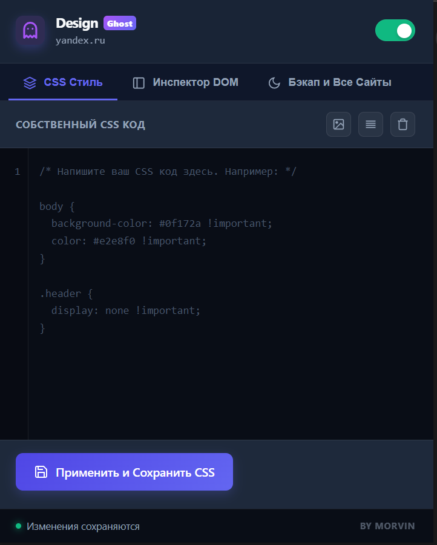
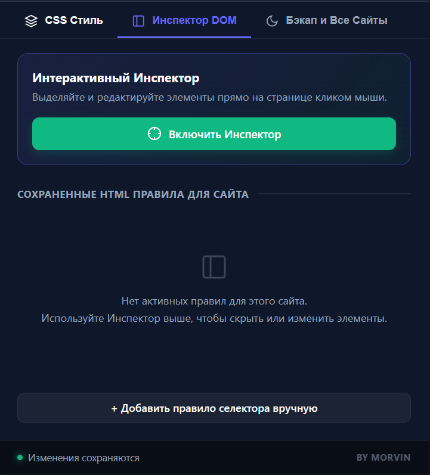
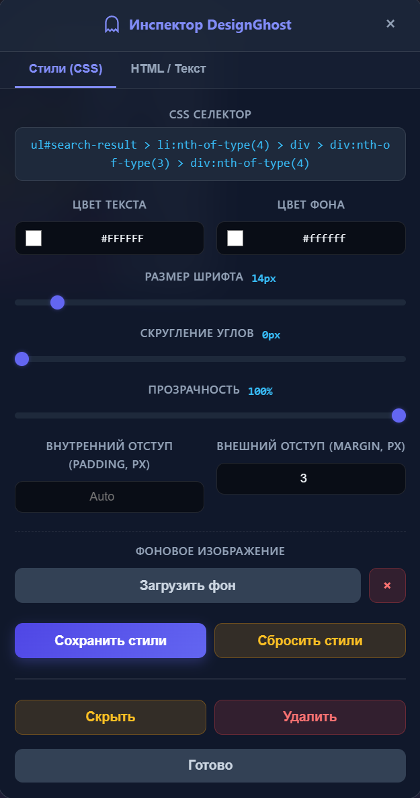

# DesignGhost — Custom CSS & HTML Inspector

**DesignGhost** — это мощное и удобное браузерное расширение (Manifest V3), предназначенное для быстрого изменения дизайна и разметки на абсолютно любом веб-сайте. Все внесенные изменения сохраняются локально в хранилище вашего браузера и автоматически применяются при перезагрузке страниц или перезапуске ПК.

Автор проекта: **[morvin](https://github.com/hellmorvin/)**

> [!WARNING]
> **ОСТЕРЕГАЙТЕСЬ ОБМАНЩИКОВ / Fake Clones!**  
> Официальный исходный код расширения DesignGhost публикуется **исключительно** на официальной странице автора: **[github.com/hellmorvin](https://github.com/hellmorvin/)**. Другие копии, неофициальные сборки в интернет-магазинах расширений или сторонние сайты могут содержать вредоносный код, вирусы или шпионские скрипты, ворующие ваши личные данные. Не загружайте это расширение из непроверенных источников!

---

## Скриншоты работы проекта / Preview







---

## Основные возможности

### 🛠️ 1. Удобный редактор CSS (Вкладка «CSS Стиль»)
В панели расширения доступен встроенный CSS-редактор с поддержкой подсветки номеров строк, интеллектуальных отступов (`Tab`) и автоматического закрытия скобок/кавычек:
*   **CSS Код**: Пишите собственные CSS стили, которые будут внедрены на выбранный сайт.
*   **Форматирование и очистка**: Поддерживает быстрое форматирование стилей и полную очистку в один клик.
*   **Кодирование изображений**: Загружайте картинки с ПК, и они автоматически конвертируются в формат Base64 Data URL `url("data:image/...")` на позиции вашего курсора.

### 🔍 2. Интерактивный инспектор элементов (Вкладка «Инспектор DOM»)
*   **Визуальное редактирование CSS**: Изменяйте цвет текста, фона, размер шрифта, скругления углов, прозрачность, а также отступы (`padding`/`margin`) с помощью удобных ползунков и интуитивно понятных элементов управления.
*   **Прямое редактирование HTML**: Изменяйте разметку конкретного элемента на лету в режиме реального времени.
*   **Скрытие и удаление**: Мгновенно скрывайте (`display: none`) или полностью удаляйте ненужные элементы и рекламные блоки со страниц.
*   **Замена картинок**: Заменяйте любые теги изображений (``) на свои локальные файлы с возможностью быстрого сброса до оригинала.
*   **Фоновые изображения**: Загружайте фоновые картинки (`background-image`) для выбранных на странице элементов прямо через панель инспектора.

### 💾 3. Резервное копирование и сброс
*   **Экспорт и Импорт**: Сохраняйте все ваши кастомные дизайны и правила для всех веб-сайтов в единый JSON-файл бэкапа и восстанавливайте их на любом другом устройстве.
*   **Быстрый сброс**: Возможность сбросить настройки для текущего сайта или очистить базу данных расширения полностью в один клик.

### ❤️ 4. Поддержка автора (morvin)
*   **Вкладка «Бэкап и Все Сайты»** содержит раздел поддержки автора с удобной прямой ссылкой на DonationAlerts.

---

## Установка расширения в браузер

Для установки расширения в режиме разработчика:

1.  Скачайте или склонируйте этот репозиторий на ваш компьютер.
2.  Откройте браузер Google Chrome (или любой другой на движке Chromium, например, Яндекс.Браузер, Brave, Opera, Edge).
3.  Перейдите по адресу: **`chrome://extensions/`** (или откройте *Настройки -> Расширения*).
4.  Включите **«Режим разработчика»** (Developer mode) в правом верхнем углу страницы.
5.  Нажмите кнопку **«Загрузить распакованное расширение»** (Load unpacked) в левом верхнем углу.
6.  Выберите корневую папку с проектом (ту, где находится файл `manifest.json`).
7.  Готово! Закрепите иконку расширения на панели браузера для быстрого доступа.

---

## Архитектура проекта

```bash
├── assets/
│   ├── screenshot1.png   # Скриншот редактора кастомных стилей
│   ├── screenshot2.png   # Скриншот DOM-инспектора в работе
│   └── screenshot3.png   # Скриншот интерфейса инспектора
├── background/
│   └── background.js     # Фоновый сервис-воркер расширения для управления иконками и бейджами
├── content/
│   ├── content.css       # Стили инспектора и всплывающего виджета на страницах
│   └── content.js        # Скрипт инспектора и инжектор пользовательских CSS правил
├── icons/
│   ├── icon16.png        # Иконки расширения разного разрешения
│   ├── icon48.png
│   └── icon128.png
├── popup/
│   ├── popup.css         # Стилизация главного окна управления (темная тема)
│   ├── popup.html        # Разметка окон управления, списков правил и CSS редактора
│   └── popup.js          # Контроллер редактора кода, экспорта, импорта и перехода на DonationAlerts
├── .gitignore            # Исключение лишних файлов из Git
├── LICENSE               # Файл открытой лицензии MIT
├── manifest.json         # Манифест конфигурации расширения (Manifest V3)
└── README.md             # Документация проекта
```

---

## Лицензия

Этот проект распространяется под свободной лицензией MIT. Вы можете использовать и модифицировать код по своему усмотрению.

Разработчик: **morvin**
